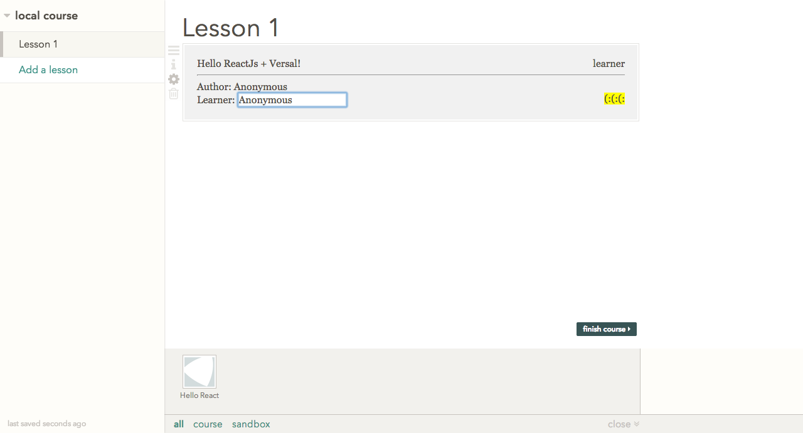
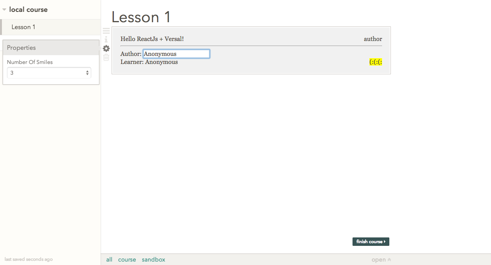

# React gadget template [](https://travis-ci.org/Versal/react-gadget-template)

## Summary

A hyper opinionated template for making [Versal](https://versal.com/gadgets) gadgets with [ReactJs](http://facebook.github.io/react/).

## Screenshots

**Default learning**



**Default authoring**



### Usage

#### Create a gadget from the template

Clone the repo and add your remote,

```
git clone https://github.com/Versal/react-gadget-template.git hello-react
cd hello-react
git remote remove origin
git remote add origin git@github.com:username/repo.git
git push origin master -u
```

Optionally add a remote for getting upstream changes

```
git remote add upstream https://github.com/Versal/react-gadget-template.git
```

#### Install prerequisites

*Note: On linux you'll need `g++` which is available through `build-essential` package on debian based distros.*

```
npm install --global gulp
npm install --global jshint
npm install --global nightwatch
```

## Install dependencies

This will build the dependencies and run the unit tests also

```
npm install
```

## Build everything

```
gulp
```

## Run unit tests

```
gulp test
```

## Run preview

```
gulp preview
```

## Run for development

Preview, watch and run tests

```
gulp develop
```

## Run demos

Start the `versal preview` command and run selenium test suite against it

```
gulp demo
```

Any arguments are passed to `nightwatch`. For example if you want to run a single group of tests

```
gulp demo --group sanity
```

## Generate screenshots

The selenium commands in `./tests/demos` take screenshots which get dumped to `./images`. These can be used for acceptance of designs and other validation.
